# Core Facility Tracker

A portable, standalone web application tailored for microscopy, bioimaging, flow cytometry, and scientific image-analysis core facilities.

Track research projects from initiation to completion with full lifecycle tracking, milestone deliverables, equipment allocation, team management, consultation notes, and one-click report exports (XLSX, DOCX, and multi-page PDF).

---

## Key Features

- **Zero-Install & Zero-Server:** Runs on PC, Mac, Linux, Android, and iPad in modern web browsers (Chrome, Edge, Firefox, Safari). No Node.js, Python, or account required. On desktop you can open `index.html` directly; **on tablets you need to open it from a web address for saving to work** — see [Running on Tablets](#running-on-tablets-android--ipad).
- **Installable (PWA):** When served over `https`, it can be added to your home screen and works offline like a native app.
- **Embedded SQLite Database:** Uses `sql.js` (asm.js single-file build) backed by browser `IndexedDB` storage with automatic debounced autosave.
- **Welcome & Onboarding Experience:**
  - **Seeded Example & Walkthrough:** Load a realistic bioimaging facility dataset (Multiphoton, STED, Lightsheet, etc.) with an interactive step-by-step tour.
  - **Start Fresh (Empty Workspace):** One-click initialization of a clean, empty database ready for direct entry.
- **Full CRUD Capabilities:**
  - **Projects:** Title, unique project code generation (`PRJ-YYMM-###`), status lifecycle (`Initiated` → `Active` → `On-hold` → `Completed` → `Archived`), priority, funding sources, modality/techniques, sample types, risk flags, timelines, tags, and notes. Includes inline researcher/PI registration.
  - **Milestones:** Deliverables with due dates, notes, assigned staff/collaborators, assigned instruments, and single-click status cycling (`pending` → `in-progress` → `done`). Overall project progress is automatically derived.
  - **Team & Lab Registry:** Principal Investigators, lab members, postdoctoral fellows, students, and core technicians with Lab/Group/Company affiliations.
  - **Core Instruments:** Microscopes, cytometers, workstations, and equipment tracking with operational status (`Available`, `In-use`, `Maintenance`, `Down`).
  - **Meetings & Consultations:** Consultation notes, known attendee tagging with lab affiliations, inline attendee registration, discussion summaries, and next step action items.
  - **Custom Metadata (KV):** Extensible project attributes (e.g. grant numbers, ethics protocol IDs, billing codes).
  - **Attachments & Links:** Local file storage (embedded safely in IndexedDB) and network/cloud link management.
- **Interactive Derived Calendar:** 7-day monthly schedule grid showing upcoming milestone deadlines and consultation meetings with direct navigation and "Today" quick view.
- **Collapsible Navigation & Adaptive Theme:** Compact icon-only sidebar mode and smart next-theme switcher (`🌙 Dark Mode` / `☀️ Light Mode`).
- **Search & Live Filtering:** Search by project title, code, PI name, modality, funding, sample type, or tags.
- **Multi-Format Report Export:**
  - **XLSX:** Comprehensive multi-sheet workbook (Overview, Milestones, Team, Instruments, Meetings, Files) via SheetJS.
  - **DOCX:** Formatted Word document summary via `docx`.
  - **PDF:** Multi-page paginated report with headers, footers, and page numbers via `jsPDF`.
- **Single-File Backup & Recovery:** Export your entire facility database (including attached files) into a self-contained `.json` backup file and restore it on any machine anytime. An automatic backup also runs roughly once every 24 hours while the app is open (toggleable in Settings), so you're never relying solely on browser storage — in Chrome/Edge, point it at the app's folder once and it writes silently into a `backups/` subfolder there with no download prompts; otherwise it falls back to a normal file download.
- **Modern SaaS Minimalist UI:** Hand-written CSS design system with Dark/Light theme switching, toast feedback, custom brand favicon, and guided onboarding tour.

---

## Screenshots

**Onboarding & first run**

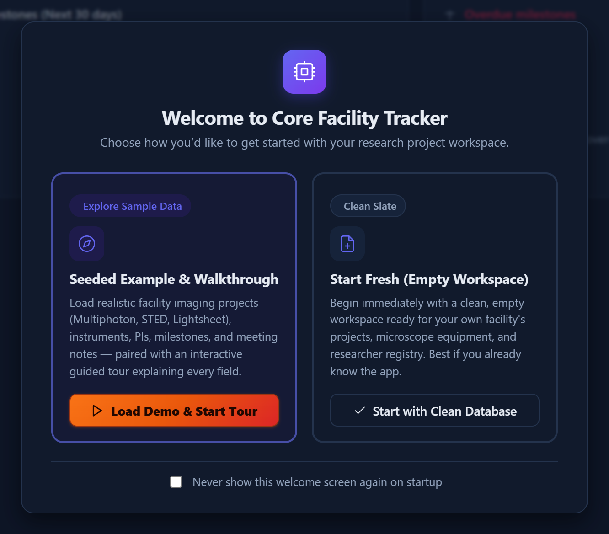

*Figure 1 — The startup modal offers a seeded demo dataset with a guided walkthrough, or a clean empty workspace.*

**Dashboard, theming & layout**

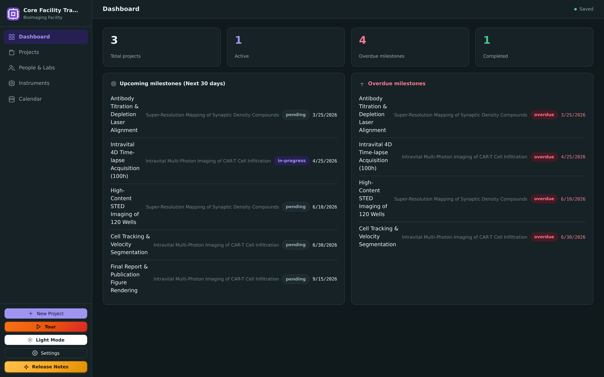

*Figure 2 — Facility Dashboard: at-a-glance KPI counters (total/active projects, overdue milestones, completed) plus upcoming and overdue milestone feeds.*

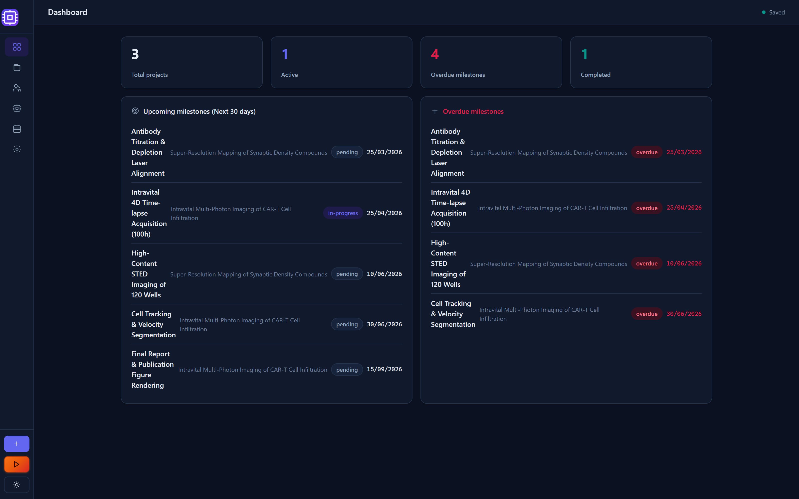

*Figure 3 — The sidebar collapses to an icon-only rail to maximize working canvas width.*

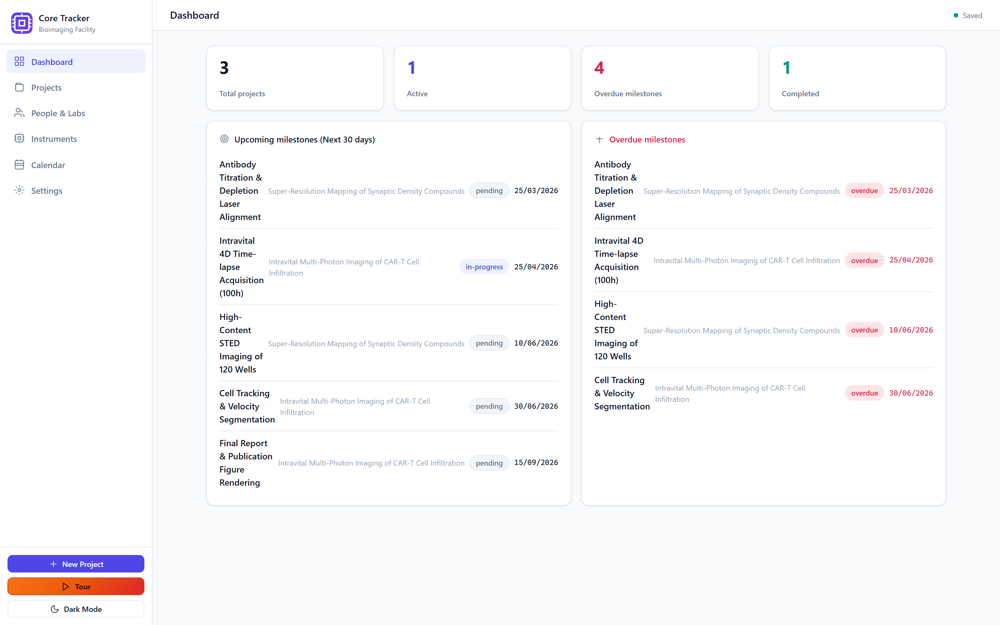

*Figure 4 — One-click Dark/Light theme switching across the entire UI.*

**Projects registry**

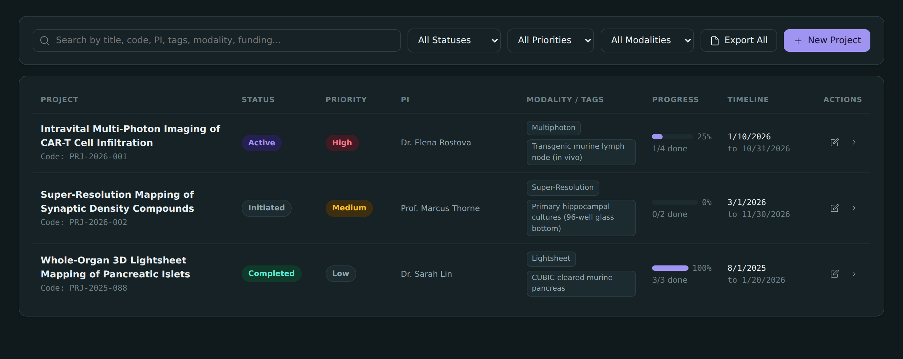

*Figure 5 — Projects Registry with live search and filtering by modality, lifecycle status, and priority.*

**Project detail**

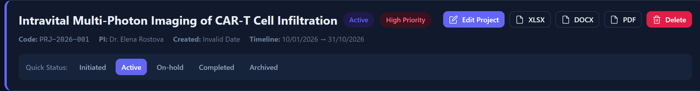

*Figure 6 — Project header: unique project code, PI, timeline, priority/status badges, one-click lifecycle stage buttons, and inline XLSX/DOCX/PDF export/delete actions.*

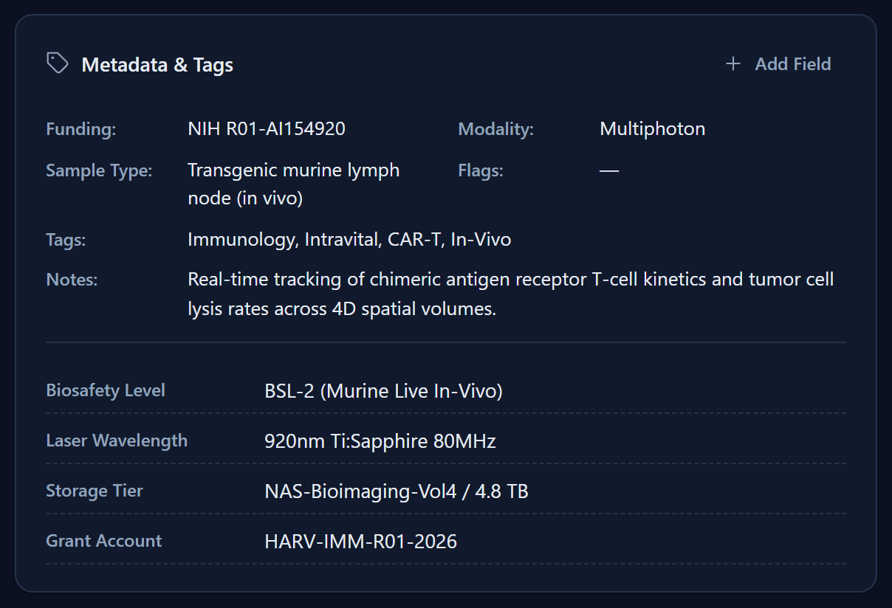 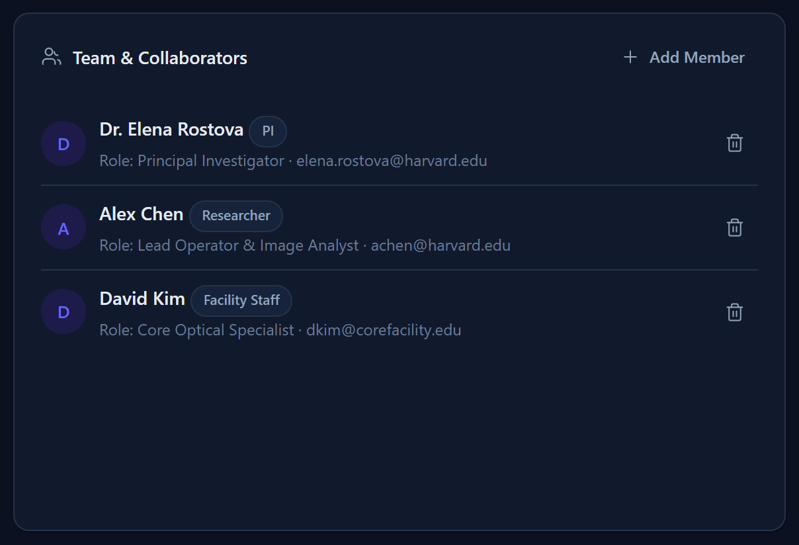

*Figure 7 — Left: funding, modality, sample type, tags, and extensible custom key-value metadata (e.g. laser wavelength, biosafety level, grant account). Right: team & collaborator roster with roles and inline contact info.*

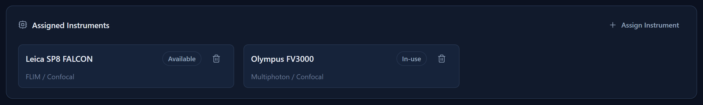

*Figure 8 — Instruments assigned to a project, with live operational status badges.*

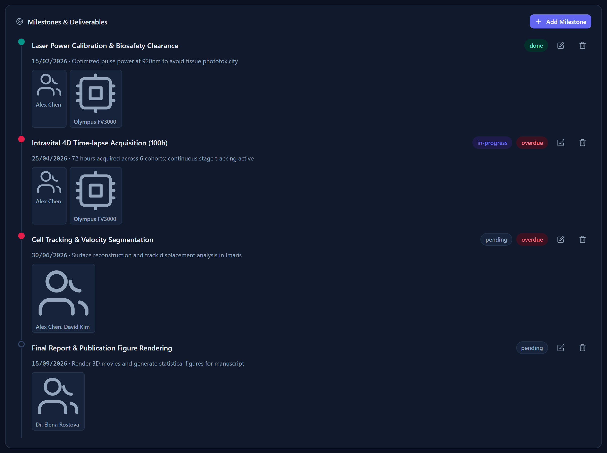

*Figure 9 — Milestones & Deliverables timeline: due dates, status (done/in-progress/pending/overdue), and assigned owners/instruments per deliverable. Clicking a status node cycles its state.*

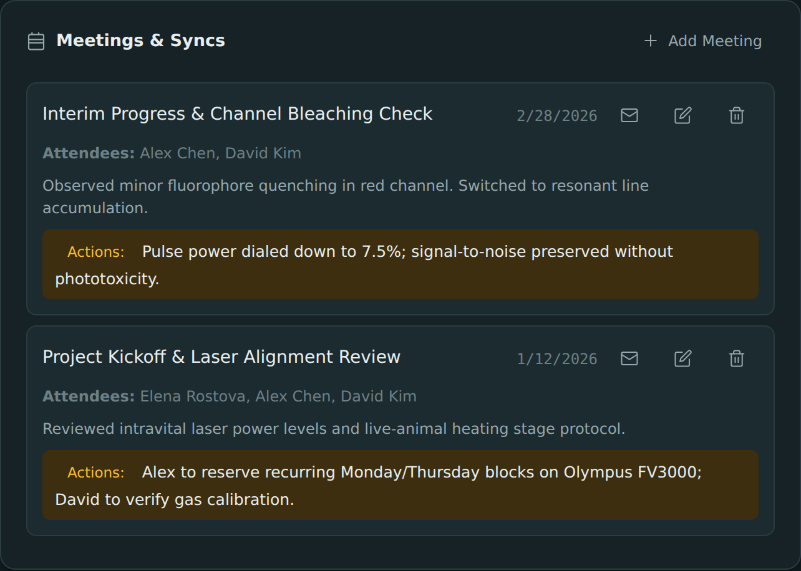

*Figure 10 — Consultation meeting notes with attendee tagging and next-step action items.*

**People, instruments & scheduling**

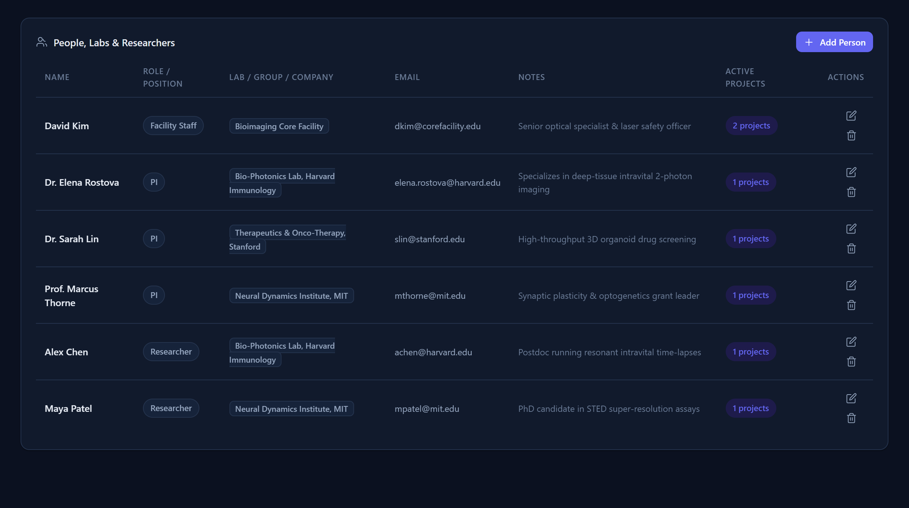

*Figure 11 — People, Labs & Researchers directory: PIs, postdocs, students, and core staff with lab/organization affiliations and active project counts.*

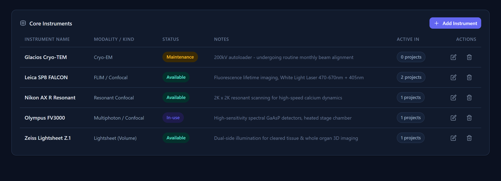

*Figure 12 — Core Instruments inventory with operational status (Available, In-use, Maintenance, Down) and imaging modality.*

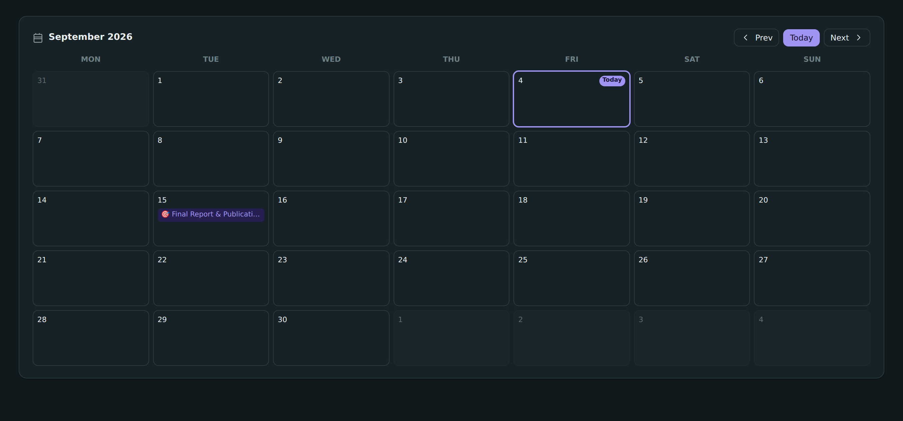

*Figure 13 — Interactive derived calendar combining milestone deadlines and scheduled consultations.*

**Settings & data portability**

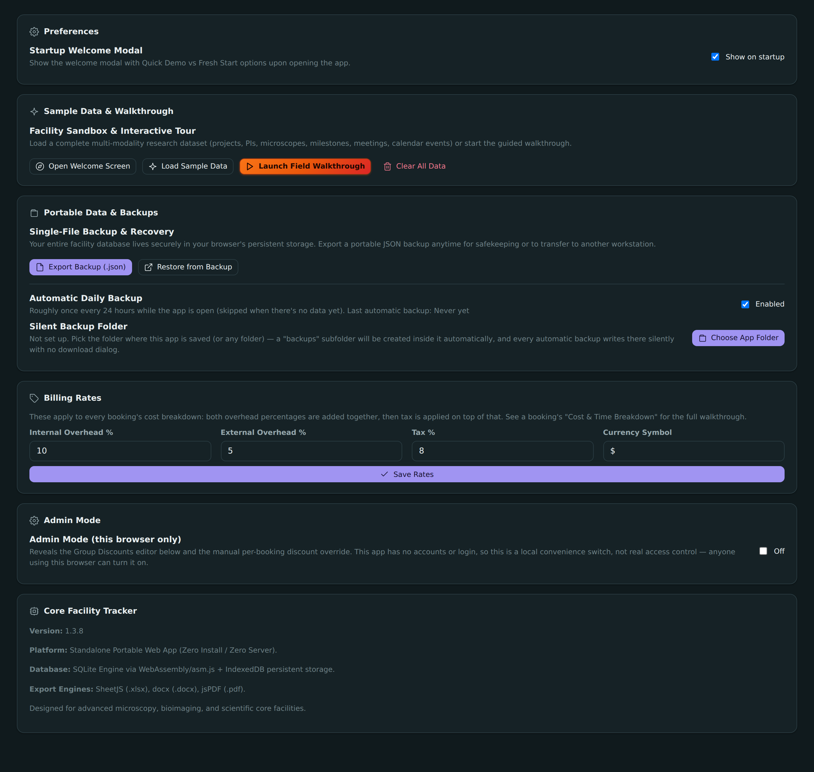

*Figure 14 — Settings: single-file JSON backup/restore, sample data reload, and startup preferences — all data stays local to the browser's IndexedDB.*

---

## Directory Structure

```text
Core-Facility-CRM/
├── index.html            # Application entry point
├── manifest.json         # PWA metadata (installable / home-screen icon)
├── sw.js                 # Service worker — offline app-shell cache (https only)
├── .nojekyll             # Tells GitHub Pages to serve all files verbatim
├── favicon.svg           # Brand logo favicon
├── css/
│   └── app.css           # Modern SaaS Minimalist design system
├── js/
│   ├── consts.js         # Shared vocabularies (modalities, statuses, priorities)
│   ├── db.js             # sql.js engine, schema, IndexedDB persistence, sample dataset & clear
│   ├── ui.js             # Toasts, modals, theme switcher, icons, interactive tour engine
│   ├── views.js          # Screen renderers (Dashboard, Projects, Detail, People, Instruments, Calendar, Settings)
│   ├── exports.js        # Multi-page PDF, DOCX, and XLSX export engines
│   └── app.js            # Routing, startup welcome modal, action dispatcher, CRUD modal logic
├── libs/
│   ├── sql-asm.js        # SQLite engine compiled to JS (asm.js, file:// compatible)
│   ├── xlsx.full.min.js  # SheetJS spreadsheet export engine
│   ├── jspdf.umd.min.js  # Client-side PDF generation engine
│   └── docx.iife.js      # Client-side DOCX document generator
├── docs/screenshots/     # README screenshots (not required to run the app)
├── LICENSE               # MIT License
└── README.md             # Documentation
```

> **`index.html`, `manifest.json`, `sw.js`, `favicon.svg`, `css/`, `js/`, and `libs/` are the entire runtime app** — that's what needs to travel together (see [Sharing With Colleagues](#sharing-the-app-with-colleagues)). Everything else (`docs/`, `LICENSE`, `README.md`) is documentation only.

---

## Quick Start

### On a computer (Windows / Mac / Linux)

1. Download or clone this repository.
2. Double-click `index.html` to open it in your browser.
3. Choose **Load Demo & Start Tour** to explore with sample data or **Start Fresh** to begin with an empty database.
4. Click **"New Project"** in the sidebar to start tracking projects!

> If your browser blocks storage for local files, the app will tell you so on a **"Storage unavailable"** screen instead of showing a blank page — follow the on-screen steps, or run the local server below.

**Optional local server** (useful if double-clicking hits storage restrictions):

```bash
python -m http.server 8734
```

Then open <http://localhost:8734/index.html>.

---

## Running on Tablets (Android / iPad)

**Important:** tablets need the app opened from a **web address**, not a file.

Browsers only allow permanent saving (IndexedDB) in a "secure context" — an `https://` (or `localhost`) address. A page opened directly from a file (`file://`, e.g. tapping `index.html` in a file manager) is treated as untrusted, so mobile browsers block or wipe its storage. That is why copying the folder to a tablet and opening the file shows an error screen (and, before this was handled, a blank page).

### Recommended: open the hosted version

1. Host the app once (see [Hosting](#hosting-github-pages) below) — e.g. `https://<your-user>.github.io/Core-Facility-CRM/`.
2. Open that link on the tablet:
   - **Android:** open in **Chrome** → menu (⋮) → **Add to Home screen**.
   - **iPad / iPhone:** open in **Safari** → Share → **Add to Home Screen**.
3. Launch it from the new home-screen icon. It now saves normally on that device and works offline.

### If you open it as a file anyway

The app still opens, but you'll get a **"Storage unavailable"** screen explaining the situation, with a **"Continue anyway (temporary session)"** option. In that mode a warning banner stays visible and **nothing is saved when you close the tab** — use **Settings → Export Backup** before closing if you want to keep anything.

---

## Hosting (GitHub Pages)

The app is plain static files with relative paths, so it can be hosted as-is — no build step.

1. Push this repository to GitHub.
2. On github.com: **Settings → Pages → Build and deployment → Deploy from a branch → `main` / `/ (root)`**.
3. Wait a minute, then open `https://<your-user>.github.io/<repo-name>/`.

The included `.nojekyll` file makes sure GitHub Pages serves every file verbatim.

### Optional: free custom domain (GitHub Student / Education Pack)

If you have an academic email address, you can claim a free domain for a year:

1. Apply at <https://education.github.com/pack> and verify your academic status.
2. Claim a domain offer from the pack (e.g. Namecheap `.me`, or name.com) on the registrar's site.
3. Add a file named `CNAME` at the repo root containing just your domain, e.g. `crm.yourname.me`.
4. At the registrar, point the domain at GitHub Pages:
   - **Subdomain** (e.g. `crm.yourname.me`) → a `CNAME` record to `<your-user>.github.io`
   - **Apex domain** (e.g. `yourname.me`) → `A` records to `185.199.108.153`, `185.199.109.153`, `185.199.110.153`, `185.199.111.153`
5. Back in **Settings → Pages**, wait for the domain to verify, then tick **Enforce HTTPS** (required for saving and offline install to work).

No code changes are needed — all asset paths are relative.

---

## Sharing the App with Colleagues

`index.html` on its own is **not** enough — it loads its stylesheet, scripts, and the SQLite engine from relative paths (`css/`, `js/`, `libs/`), so the folder structure has to travel together.

**What to send:** the whole project folder (or a zip of it) containing at minimum:

```text
index.html
manifest.json
sw.js
favicon.svg
css/
js/
libs/
```

`LICENSE`, `README.md`, and `docs/` are documentation only and can be left out.

**How to share it:**

- **Share a hosted link** (see [Hosting](#hosting-github-pages)) — best option, and the only one that works properly on tablets.
- **Zip the folder** and send it directly — the recipient unzips it and opens `index.html` on a computer.
- **Share the GitHub repo** (clone or "Download ZIP") so everyone always gets the latest version.

No installation, server, or account is required. Note that **sharing the app is not sharing data** — each person's data is saved locally in their own browser, so colleagues won't see each other's projects unless they exchange a backup file (**Settings → Export Backup**).

---

## Data Safety & Privacy

### Your data is per-device — there is no sync

All project data, attachments, and metadata remain **100% local to your machine**. No data is ever sent to external cloud servers or third parties.

Because of that, please be clear on what this means in practice:

- Data lives in **one browser on one device**. Your tablet and your laptop each hold a **separate, independent database**.
- **Hosting the app does not share data.** Two people opening the same hosted link each get their own private database — you will not see each other's projects.
- There is **no multi-user or live collaboration.** The app is designed for single-device use.
- The only way to move data between devices or people is **Settings → Export Backup** → send/copy the `.json` file → **Restore from Backup** on the other device.

The app states this up front on first run so it's never a surprise.

### Backups

Backups (including attachments) can be exported anytime via **Settings → Export Backup**, and an automatic dated backup runs roughly every 24 hours while the app is open as an additional safety net against browser storage being cleared — written silently into a `backups/` subfolder next to the app (Chrome/Edge, after a one-time folder selection), or downloaded normally otherwise.

### Using a cloud folder (Google Drive, Dropbox, OneDrive)

You can point backups at a cloud-synced folder, or drop exported backups there manually, as a convenience. **This is a manual backup, not sync** — know the trade-offs:

- **It's only as current as your last export.** The live database stays in browser storage; nothing updates the cloud file until a backup runs or you export one.
- **Editing on two devices will lose work.** If both devices have changes and you import a backup, whichever you import *last* overwrites the other device's edits entirely. There is no merge.
- **Backups with attachments can get large**, since uploaded files are embedded in the `.json`.
- **Privacy follows the cloud account.** A backup in a shared or synced folder is readable by anyone with access to that folder — treat it like any other sensitive research file.

> Putting the *app folder* itself in Drive does **not** sync your data — the database lives in browser storage, not in the folder. Only exported backup files carry data.

---

## License

This project is open source under the [MIT License](LICENSE).
