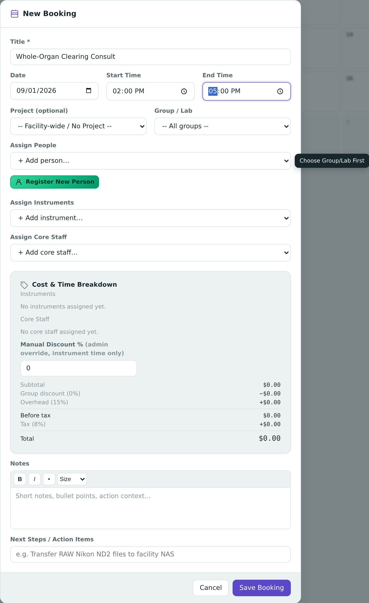
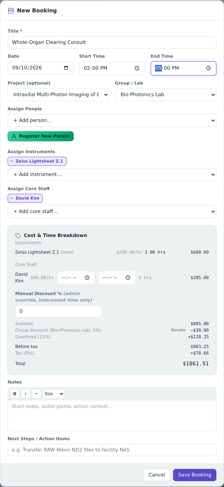
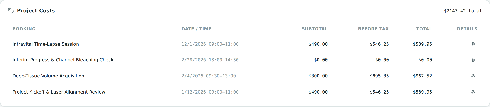
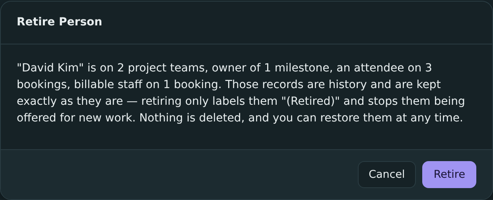
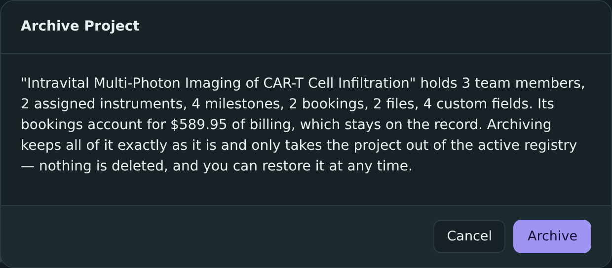
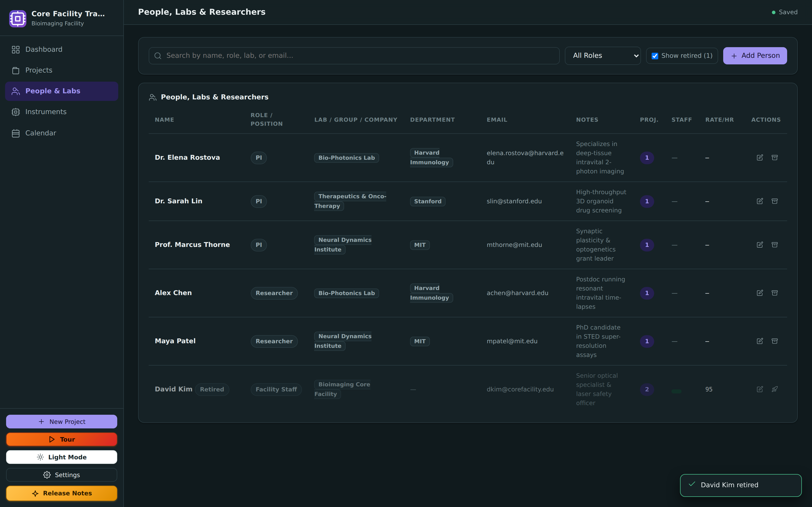
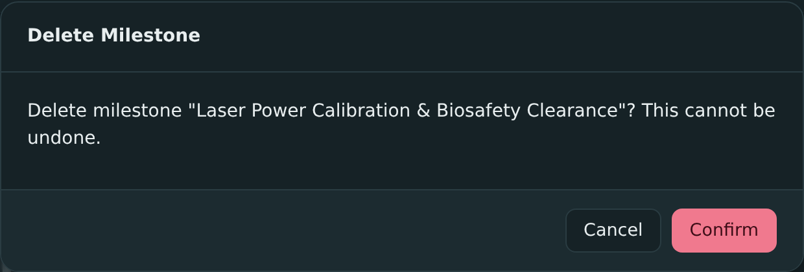
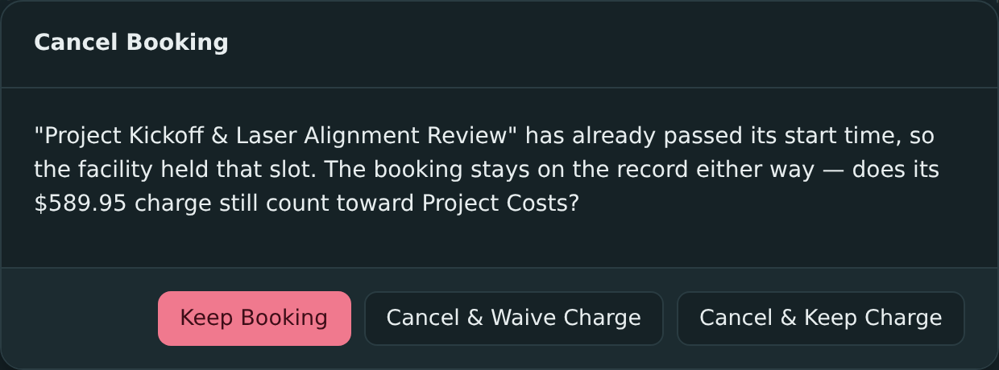
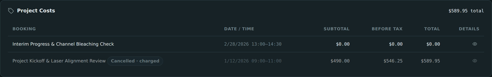

# Core Facility Tracker

A portable, standalone web application tailored for microscopy, bioimaging, flow cytometry, and scientific image-analysis core facilities.

Track research projects from initiation to completion with full lifecycle tracking, milestone deliverables, equipment allocation, team management, consultation notes, and one-click report exports (XLSX, DOCX, and multi-page PDF).

---

📖 **New to the app?** Read the [User Manual](https://daniel-waiger.github.io/Core-Facility-CRM/docs/manual/) — a searchable, illustrated guide to every feature.

---

## Key Features

- **Zero-Install & Zero-Server:** Runs on PC, Mac, Linux, Android, and iPad in modern web browsers (Chrome, Edge, Firefox, Safari). No Node.js, Python, or account required. On desktop you can open `index.html` directly; **on tablets you need to open it from a web address for saving to work** — see [Running on Tablets](#running-on-tablets-android--ipad).
- **Installable:** Served over `https`, it can be added to your home screen and opens like any other app — including offline, with no connection. (This is what a "progressive web app", or PWA, means.)
- **A Real Database, Inside the Browser:** Your data lives in a genuine SQLite database that runs in the browser itself (`sql.js`) and is saved into the browser's own storage as you work — no server holds it, and nothing is uploaded anywhere.
- **Welcome & Onboarding Experience:**
  - **Seeded Example & Walkthrough:** Load a realistic bioimaging facility dataset (Multiphoton, STED, Lightsheet, etc.) with an interactive step-by-step tour.
  - **Start Fresh (Empty Workspace):** One click sets up a clean, empty database, ready for your own records.
- **Everything You Track (add it, find it, change it):**
  - **Projects:** Title, unique project code generation (`PRJ-YYMM-###`), status lifecycle (`Initiated` → `Active` → `On-hold` → `Completed` → `Archived`), priority, funding sources, modality/techniques, sample types, risk flags, timelines, tags, and notes. Includes inline researcher/PI registration.
  - **Milestones:** Deliverables with due dates, notes, assigned staff and collaborators, assigned instruments, and a status you advance with one click (`pending` → `in-progress` → `done`). The project's overall progress is worked out from them.
  - **Team & Lab Registry:** Principal Investigators, lab members, postdoctoral fellows, students, and core technicians with Lab/Group/Company affiliations.
  - **Core Instruments:** Microscopes, cytometers, workstations, and equipment tracking with operational status (`Available`, `In-use`, `Maintenance`, `Down`).
  - **Meetings, Bookings & Consultations:** Consultation notes, known attendee tagging with lab affiliations, inline attendee registration, discussion summaries, and next step action items. Each entry can carry a **Category** (sync, consult, training, assisted session — extensible), which is what lets the reports count consults and split facility hours by activity; it is optional: untagged entries get an explicit "(uncategorized)" slice in the activity mix, and simply aren't consults, so they never enter the consult counts.
  - **Research Outputs:** Publications, acknowledgements, datasets and other outputs logged against a project — the far end of the consult-to-output funnel, and their own sheet in the exports.
  - **Custom Fields:** Add your own named fields to a project for whatever this facility needs to record — ethics protocol IDs, internal billing codes, a laser wavelength.
  - **Attachments & Links:** Local file storage (embedded safely in IndexedDB) and network/cloud link management.
- **Calendar — Month, Week and Timeline:** A month grid of milestone deadlines and bookings, an hourly **Week** grid (with an all-day lane for milestones and untimed bookings), and a per-instrument **Timeline** with one lane per instrument across the week. Month and Week share one query and one event-chip renderer, so they can't caption the same day differently; Timeline is per-instrument by nature, so its lanes show only bookings that have an instrument attached, and no milestones. Clicking an empty **hour slot** in Week or Timeline starts a booking pre-filled with that date and hour — plus, in Timeline, that lane's instrument (skipped for a retired instrument, which still shows its history but takes no new work); clicking a month cell or an all-day lane pre-fills the date only.
- **Scheduling With Guardrails:** Bookings are conflict-checked **as you type** and hard-blocked at save by the very same rule set, so the advisory can never drift from the gate. Each instrument can carry an optional minimum/maximum session duration, a minimum gap between bookings, and a minimum advance notice (0 = unconstrained). **Recurring bookings** repeat every N weeks until a date (capped at 52 occurrences), with every occurrence conflict-checked up front so the save is all-or-nothing — the as-you-type advisory only reads the first one. A cancelled booking releases its slot; reinstating one re-checks that slot for conflicts before it starts holding it again, waiving only the advance-notice rule, which a slot booked long ago can no longer satisfy.
- **Collapsible Navigation & Adaptive Theme:** Compact icon-only sidebar mode and smart next-theme switcher (`🌙 Dark Mode` / `☀️ Light Mode`).
- **Search & Live Filtering:** Search by project title, code, PI name, modality, funding, sample type, or tags.
- **Billing, Rates, Grants & Service Entries:**
  - **Pricing tiers:** named overhead tiers (e.g. Internal / Academia / Industry) assigned per lab/group, with optional per-instrument rate overrides. The tier and percent resolved at save are **snapshotted onto the booking**, so a later rate change never silently reprices past work.
  - **Per-category staff billing:** each booking category sets what percent of a Facility Staff member's normal rate it bills — a consult can bill **0%** while the staff member stays properly assigned to the session — and whether that category requires a staff assignee before it can be saved.
  - **Grants:** name, number, note and an allowed-users list; pickable on projects and bookings, shown by name *or* by number facility-wide via one Settings toggle, and carried into Project Costs and the project and facility-wide exports for reconciliation (on the Reports workbook it rides along on the Service Entries sheet).
  - **Standalone service entries:** technician time, sample prep or per-unit items billed outside any booking (quantity × rate into a frozen cost snapshot), counted into Project Costs, the reports and the exports alongside bookings.
  - **Configurable cancellation rules:** whether a before-start or an after-start cancellation's charge still counts toward Project Costs is a per-facility setting, defaulting to the app's original behaviour (before = dropped, after = kept).
- **Reports & Utilization:** A date-ranged reporting screen answering the questions a facility actually gets asked — instrument hours and revenue, facility-staff time per instrument, spend per project and per lab, consults per instrument and month, standalone service entries, an **instrument stewardship scorecard** grouped by supervising staff (bookings, hours, revenue, distinct and new users, projects served, facility-wide sessions, consults), **breadth** (how many labs and people you serve, and how many are new, with per-lab consult attribution behind an off-by-default toggle) and an **activity mix** splitting facility hours by whichever categories are tagged on bookings, plus a **consult-to-output funnel** with a conversion rate at every stage and two medians — time from project created to first booking, and from first booking to first research output. Two rules hold everywhere: booked hours exclude cancelled bookings (a cancellation releases the slot, so the instrument was never occupied), and money follows the Project Costs rule — a cancelled booking's charge counts only if it was retained. Staff time is reported both as hours actually worked and as hours billed, since billing rounds up to whole hours.
- **Charts, and a Custom Report Generator:** Utilization, funnel and activity-mix cards each carry an inline SVG chart (hand-drawn, no chart library, themed light/dark) that reads the exact same numbers as the table beneath it. A **Custom Report** builder lets you pick an entity, the columns you want and a date range, preview it live, and export precisely that — driven from the same aggregation code as the screen, so a figure you exported and a figure you read off a card can never disagree. (One entity, the row-level Bookings listing, exists only inside the custom builder — it has no card of its own.)
- **Multi-Format Report Export:**
  - **XLSX:** Three workbooks, all via SheetJS. Per project: Overview, Milestones, Team, Instruments, Meetings, Service Entries, Files, Research Outputs. Facility-wide ("Export All", and the copy the silent auto-backup drops beside the JSON): Projects, Milestones, People, Instruments, Meetings, Bookings & Costs, Service Entries, Research Outputs. The Reports screen has its own workbook — a **Notes** sheet first, carrying each table's caveats, then utilization, staff time, staff × instrument, projects & groups, stewardship, consults, service entries, breadth, activity mix and funnel, plus a Per-Lab Consults sheet when that opt-in toggle is on.
  - **DOCX:** Formatted Word document summary via `docx`.
  - **PDF:** Multi-page paginated report with headers, footers, and page numbers via `jsPDF`.
- **Single-File Backup & Recovery:** Export your entire facility database (including attached files) into a self-contained `.json` backup file and restore it on any machine anytime. An automatic backup also runs roughly once every 24 hours while the app is open (toggleable in Settings), so you're never relying solely on browser storage — in Chrome/Edge, point it at the app's folder once and it writes silently into a `backups/` subfolder there with no download prompts; otherwise it falls back to a normal file download.
- **Modern SaaS Minimalist UI:** Hand-written CSS design system with Dark/Light theme switching, toast feedback, custom brand favicon, and guided onboarding tour.
- **History Is Never Destroyed:** People and instruments are **retired**, projects are **archived**, and bookings are **cancelled** — never deleted — so who attended a session, which instrument ran it, who was PI, and the billing behind every cost snapshot all survive. Retired and archived records are labelled wherever they appear, drop out of the pickers for new work, stay put on everything they already belong to, and can be restored at any time. A cancelled booking stays logged with its line items and frees its instrument slot; whether its charge still counts toward Project Costs depends on whether it had already started, with Admin Mode able to waive a late cancellation's charge. Only records nothing references at all can still be deleted outright.

---

## Screenshots

<a href="https://daniel-waiger.github.io/Core-Facility-CRM/docs/gallery.html">
  
</a>

**▶ [Browse every screen in the interactive gallery](https://daniel-waiger.github.io/Core-Facility-CRM/docs/gallery.html)** — a full-size carousel with arrow-key navigation, thumbnails, and a shareable link per shot. It lists `docs/screenshots/` live from this repository, so it always shows the current set, including shots not reproduced below.

A selection follows.

**Onboarding & first run**


*Figure 1 — The startup modal offers a seeded demo dataset with a guided walkthrough, or a clean empty workspace.*

**Dashboard, theming & layout**


*Figure 2 — Facility Dashboard: at-a-glance KPI counters (total/active projects, overdue milestones, completed) plus upcoming and overdue milestone feeds.*


*Figure 3 — The sidebar collapses to an icon-only rail to maximize working canvas width.*


*Figure 4 — One-click Dark/Light theme switching across the entire UI.*

**Projects registry**


*Figure 5 — Projects Registry with live search and filtering by modality, lifecycle status, and priority.*

**Project detail**


*Figure 6 — Project header: unique project code, PI, timeline, priority/status badges, one-click lifecycle stage buttons, and inline XLSX/DOCX/PDF export/delete actions.*

 

*Figure 7 — Left: funding, modality, sample type, tags, and extensible custom key-value metadata (e.g. laser wavelength, biosafety level, grant account). Right: team & collaborator roster with roles and inline contact info.*


*Figure 8 — Instruments assigned to a project, with live operational status badges.*


*Figure 9 — Milestones & Deliverables timeline: due dates, status (done/in-progress/pending/overdue), and assigned owners/instruments per deliverable. Clicking a status node cycles its state.*


*Figure 10 — Consultation meeting notes with attendee tagging and next-step action items.*

**People, instruments & scheduling**


*Figure 11 — People, Labs & Researchers directory: PIs, postdocs, students, and core staff with lab/organization affiliations and active project counts.*


*Figure 12 — Core Instruments inventory with operational status (Available, In-use, Maintenance, Down) and imaging modality.*


*Figure 13 — The calendar's month view, combining milestone deadlines and scheduled bookings. A Week (hourly grid) and a per-instrument Timeline view sit behind the same Month/Week/Timeline toggle.*

**Settings & data portability**


*Figure 14 — Settings: single-file JSON backup/restore, sample data reload, and startup preferences — all data stays local to the browser's IndexedDB.*

**Billing & cost tracking**



*Figure 15 — A booking starts with its Group / Lab. Until one is picked (directly, or auto-filled from the project's PI), the "Assign People" and "Assign Facility Staff" dropdowns stay locked with a "Choose Group/Lab First" hint — and the cost breakdown has no lab rate to bill against yet.*



*Figure 16 — With a lab chosen, its standing discount is applied automatically and the Cost & Time Breakdown recomputes live: instrument time, group discount (with an admin-only **Revoke** control), stacked overhead, tax, and total.*



*Figure 17 — Project Costs: every booking's saved cost snapshot (subtotal → before tax → total) with a running total for the project.*

**Retiring, archiving & safe deletes**



*Figure 18 — People are retired, not deleted. The dialog counts up exactly where they appear — project teams, milestones, bookings they attended, bookings they were billable staff on — and every one of those records is kept untouched. Retiring only labels them "(Retired)" and stops them being offered for new work. It can be undone.*



*Figure 19 — Projects are archived, not deleted. A project is the thread tying together who worked on it, which instruments ran, and what was charged — so archiving keeps the title, team, instruments, milestones, files, custom fields and every booking with its cost snapshot, and names the billing total it is preserving. It only leaves the active registry.*



*Figure 20 — Retired and archived records are hidden from day-to-day lists behind a "Show retired / Show archived" toggle that appears only when there are any — then shown badged, muted, and offering **Restore**. They remain visible wherever they are part of a historical record: a booking still lists the retired staff member who ran it.*



*Figure 21 — On a destructive confirmation the red button is **Cancel**, not the destructive one. Colour is what the eye lands on first, and on a dialog that exists to prevent an accident, the safe way out is what deserves that attention. The destructive button stays plainly labelled ("Delete", "Retire", "Archive") but is styled quietly.*



*Figure 22 — Bookings are cancelled, not deleted: the session stays logged with its line items and its instrument slot is freed for someone else. Whether the charge still counts toward Project Costs follows from when it was cancelled — by default dropped if it never started and kept if the slot was held, and each facility can set those two cases independently in Settings. For a late cancellation, Admin Mode offers this three-way choice to waive it instead.*



*Figure 23 — Project Costs after a late cancellation where the charge was kept: the row is badged, and the running total still reflects it. A waived charge instead shows struck through and drops out of the total, so the figure always matches what is actually billed.*

---

## Booking a Session: Attendees vs. Facility Staff

A booking has two separate people fields, and they mean different things. Getting them the right
way round is what makes the billing and the reports come out right.

**Assign People** — the researchers the session is *for*: the PI, the student, whoever is bringing
the samples. They are recorded as attendees and are **never billed by the hour**. A booking starts
by picking its **Group / Lab**, and this picker is scoped to that group, because at institute scale
a dropdown listing every person in the building is unusable. So book under the group the *user*
belongs to — that is also what determines which standing lab discount applies to the session.

**Assign Facility Staff** — the core staff *running or supporting* the session. Their time is
billable: each one bills their own hourly rate, for their own window inside the booking (leave the
window blank and it bills the whole booking), with a 1-hour minimum, rounded up to whole hours.

### How the app knows who is facility staff

It doesn't infer it. A person appears in the **Assign Facility Staff** picker for exactly one
reason: the **Facility Staff** box is ticked on their own record (People & Labs → edit a person),
which is also where their hourly rate lives. Nothing else — not their Role, not their Lab/Group,
not their Department — has any effect on it.

That means you do **not** need a separate "STAFF" group to make staff assignable. Tick the box on
each core staff member once, and from then on they are available on every booking regardless of
which group the booking itself is under. On the People list, the **Facility Staff** column shows
who is flagged, and the **Facility staff only** filter shows just them.

Un-ticking the box takes someone out of the picker for *new* assignments but leaves every booking
they have already worked — and the billing line behind it — completely intact.

---

## Directory Structure

```text
Core-Facility-CRM/
├── index.html            # Application entry point
├── manifest.json         # PWA metadata (installable / home-screen icon)
├── sw.js                 # Service worker — offline app-shell cache (https only)
├── .nojekyll             # Tells GitHub Pages to serve all files verbatim
├── favicon.svg           # Brand logo favicon
├── css/
│   └── app.css           # Modern SaaS Minimalist design system
├── js/
│   ├── consts.js         # Shared vocabularies (modalities, statuses, priorities)
│   ├── db.js             # sql.js engine, schema, IndexedDB persistence, sample dataset & clear
│   ├── ui.js             # Toasts, modals, theme switcher, icons, interactive tour engine
│   ├── views.js          # Screen renderers (Dashboard, Projects, Detail, People, Instruments, Calendar, Settings)
│   ├── reports.js        # Reports & Utilization (utilization, staff time, project/lab spend, consults,
│   │                     #   service entries, stewardship, breadth, activity mix, funnel, charts, custom reports)
│   ├── exports.js        # Multi-page PDF, DOCX, and XLSX export engines
│   └── app.js            # Routing, startup welcome modal, action dispatcher, CRUD modal logic
├── libs/
│   ├── sql-asm.js        # SQLite engine compiled to JS (asm.js, file:// compatible)
│   ├── xlsx.full.min.js  # SheetJS spreadsheet export engine
│   ├── jspdf.umd.min.js  # Client-side PDF generation engine
│   └── docx.iife.js      # Client-side DOCX document generator
├── docs/
│   ├── index.html        # Hosted release-notes page (renders CHANGELOG.md live)
│   ├── gallery.html      # Screenshot carousel (lists docs/screenshots/ live from GitHub)
│   ├── manual/           # Hosted user manual (searchable, illustrated)
│   └── screenshots/      # README screenshots (not required to run the app)
├── LICENSE               # MIT License
└── README.md             # Documentation
```

> **`index.html`, `manifest.json`, `sw.js`, `favicon.svg`, `css/`, `js/`, and `libs/` are the entire runtime app** — that's what needs to travel together (see [Sharing With Colleagues](#sharing-the-app-with-colleagues)). Everything else (`docs/`, `LICENSE`, `README.md`) is documentation only.

---

## Quick Start

### On a computer (Windows / Mac / Linux)

1. Download or clone this repository.
2. Double-click `index.html` to open it in your browser.
3. Choose **Load Demo & Start Tour** to explore with sample data or **Start Fresh** to begin with an empty database.
4. Click **"New Project"** in the sidebar to start tracking projects!

> If your browser blocks storage for local files, the app will tell you so on a **"Storage unavailable"** screen instead of showing a blank page — follow the on-screen steps, or run the local server below.

**Optional local server** (useful if double-clicking hits storage restrictions):

```bash
python -m http.server 8734
```

Then open <http://localhost:8734/index.html>.

---

## Running on Tablets (Android / iPad)

**Important:** tablets need the app opened from a **web address**, not a file.

Browsers only allow permanent saving (IndexedDB) in a "secure context" — an `https://` (or `localhost`) address. A page opened directly from a file (`file://`, e.g. tapping `index.html` in a file manager) is treated as untrusted, so mobile browsers block or wipe its storage. That is why copying the folder to a tablet and opening the file shows an error screen (and, before this was handled, a blank page).

### Recommended: open the hosted version

1. Host the app once (see [Hosting](#hosting-github-pages) below) — e.g. `https://<your-user>.github.io/Core-Facility-CRM/`.
2. Open that link on the tablet:
   - **Android:** open in **Chrome** → menu (⋮) → **Add to Home screen**.
   - **iPad / iPhone:** open in **Safari** → Share → **Add to Home Screen**.
3. Launch it from the new home-screen icon. It now saves normally on that device and works offline.

### If you open it as a file anyway

The app still opens, but you'll get a **"Storage unavailable"** screen explaining the situation, with a **"Continue Anyway (Temporary Session)"** option. In that mode a warning banner stays visible and **nothing is saved when you close the tab** — use **Settings → Export Backup** before closing if you want to keep anything.

---

## Hosting (GitHub Pages)

The app is plain static files with relative paths, so it can be hosted as-is — no build step.

1. Push this repository to GitHub.
2. On github.com: **Settings → Pages → Build and deployment → Deploy from a branch → `main` / `/ (root)`**.
3. Wait a minute, then open `https://<your-user>.github.io/<repo-name>/`.

The included `.nojekyll` file makes sure GitHub Pages serves every file verbatim.

### Optional: free custom domain (GitHub Student / Education Pack)

If you have an academic email address, you can claim a free domain for a year:

1. Apply at <https://education.github.com/pack> and verify your academic status.
2. Claim a domain offer from the pack (e.g. Namecheap `.me`, or name.com) on the registrar's site.
3. Add a file named `CNAME` at the repo root containing just your domain, e.g. `crm.yourname.me`.
4. At the registrar, point the domain at GitHub Pages:
   - **Subdomain** (e.g. `crm.yourname.me`) → a `CNAME` record to `<your-user>.github.io`
   - **Apex domain** (e.g. `yourname.me`) → `A` records to `185.199.108.153`, `185.199.109.153`, `185.199.110.153`, `185.199.111.153`
5. Back in **Settings → Pages**, wait for the domain to verify, then tick **Enforce HTTPS** (required for saving and offline install to work).

No code changes are needed — all asset paths are relative.

---

## Sharing the App with Colleagues

`index.html` on its own is **not** enough — it loads its stylesheet, scripts, and the SQLite engine from relative paths (`css/`, `js/`, `libs/`), so the folder structure has to travel together.

**What to send:** the whole project folder (or a zip of it) containing at minimum:

```text
index.html
manifest.json
sw.js
favicon.svg
css/
js/
libs/
```

`LICENSE`, `README.md`, and `docs/` are documentation only and can be left out.

**How to share it:**

- **Share a hosted link** (see [Hosting](#hosting-github-pages)) — best option, and the only one that works properly on tablets.
- **Zip the folder** and send it directly — the recipient unzips it and opens `index.html` on a computer.
- **Share the GitHub repo** (clone or "Download ZIP") so everyone always gets the latest version.

No installation, server, or account is required. Note that **sharing the app is not sharing data** — each person's data is saved locally in their own browser, so colleagues won't see each other's projects unless they exchange a backup file (**Settings → Export Backup**).

---

## Data Safety & Privacy

### Your data is per-device — there is no sync

All project data, attachments, and metadata remain **100% local to your machine**. No data is ever sent to external cloud servers or third parties.

Because of that, please be clear on what this means in practice:

- Data lives in **one browser on one device**. Your tablet and your laptop each hold a **separate, independent database**.
- **Hosting the app does not share data.** Two people opening the same hosted link each get their own private database — you will not see each other's projects.
- There is **no multi-user or live collaboration.** The app is designed for single-device use.
- The only way to move data between devices or people is **Settings → Export Backup** → send/copy the `.json` file → **Restore from Backup** on the other device.

The app states this up front on first run so it's never a surprise.

### Backups

Backups (including attachments) can be exported anytime via **Settings → Export Backup**, and an automatic dated backup runs roughly every 24 hours while the app is open as an additional safety net against browser storage being cleared — written silently into a `backups/` subfolder next to the app (Chrome/Edge, after a one-time folder selection), or downloaded normally otherwise.

### Using a cloud folder (Google Drive, Dropbox, OneDrive)

You can point backups at a cloud-synced folder, or drop exported backups there manually, as a convenience. **This is a manual backup, not sync** — know the trade-offs:

- **It's only as current as your last export.** The live database stays in browser storage; nothing updates the cloud file until a backup runs or you export one.
- **Editing on two devices will lose work.** If both devices have changes and you import a backup, whichever you import *last* overwrites the other device's edits entirely. There is no merge.
- **Backups with attachments can get large**, since uploaded files are embedded in the `.json`.
- **Privacy follows the cloud account.** A backup in a shared or synced folder is readable by anyone with access to that folder — treat it like any other sensitive research file.

> Putting the *app folder* itself in Drive does **not** sync your data — the database lives in browser storage, not in the folder. Only exported backup files carry data.

---

## License

This project is open source under the [MIT License](LICENSE).
